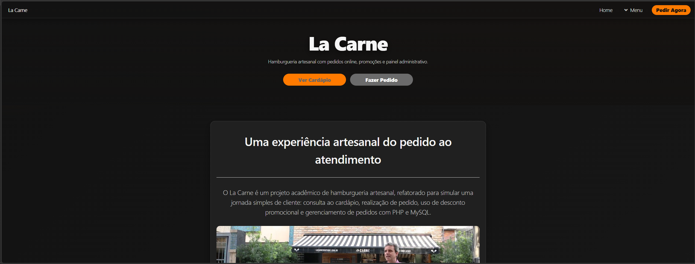
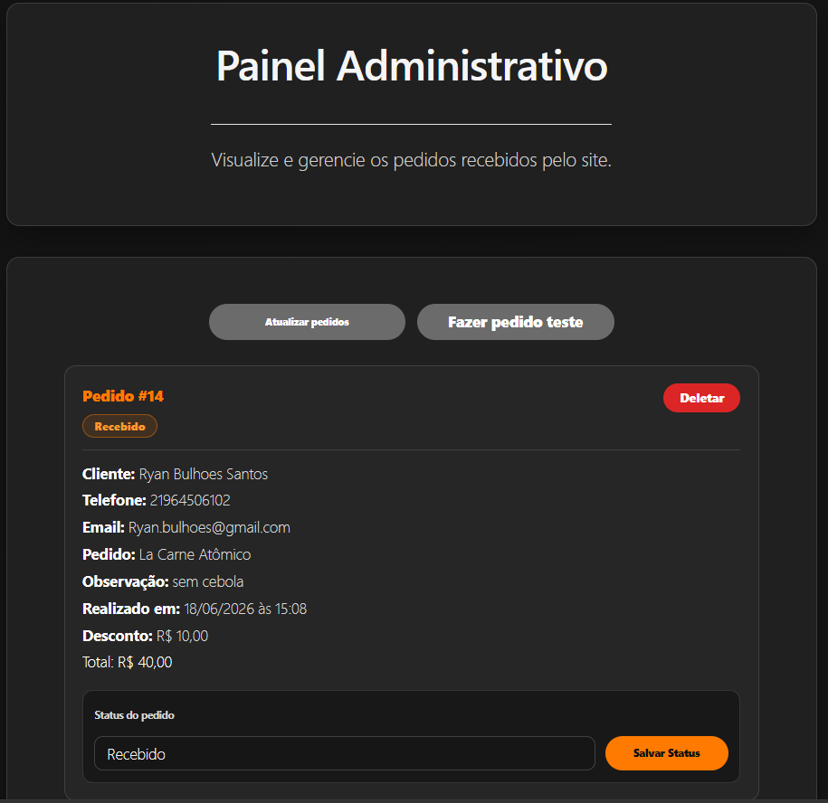

# La Carne — Sistema de Pedidos

Projeto acadêmico refatorado de uma hamburgueria fictícia, desenvolvido com HTML, CSS, JavaScript, PHP e MySQL.

A aplicação simula um fluxo simples de pedidos online, com cardápio, formulário, jogo promocional de descontos e painel administrativo para acompanhar os pedidos registrados.

## Sobre o projeto

Este projeto foi criado originalmente durante a faculdade, em uma fase inicial dos meus estudos em desenvolvimento web.

Posteriormente, ele foi refatorado para melhorar a organização dos arquivos, a interface, a lógica de pedidos e a integração com banco de dados.

O objetivo da refatoração foi transformar um projeto acadêmico antigo em uma versão mais limpa, funcional e adequada para portfólio.


## Preview

<p align="center">
  
  
</p>

<p align="center">
  <em>Página inicial e painel administrativo do sistema.</em>
</p>


## Funcionalidades

* Página inicial com apresentação da hamburgueria
* Cardápio com produtos e preços
* Formulário para realizar pedidos
* Adição de múltiplos itens no mesmo pedido
* Jogo da Sorte com geração de cupom de desconto
* Preenchimento automático do cupom no formulário
* Validação de produtos, cupons e valores no backend
* Cálculo de desconto e valor final realizado pelo PHP
* Persistência de pedidos em banco de dados MySQL
* Painel administrativo para listar pedidos
* Exibição de data, horário e status do pedido
* Atualização de status: Recebido, Em preparo, Saiu para entrega, Concluído ou Cancelado
* Exclusão de pedidos pelo painel administrativo
* Validação de métodos HTTP nos endpoints da API

## Tecnologias utilizadas

### Desenvolvimento

* HTML5
* CSS3
* JavaScript
* PHP
* MySQL

### Ferramentas

* XAMPP
* phpMyAdmin
* Git
* GitHub
* Visual Studio Code

## Estrutura do projeto

```txt
PLaCarne-Refatorado/
├── index.html
├── cardapio.html
├── formulario.html
├── galeria.html
├── informacoes.html
├── sorteio.html
├── admin.html
├── assets/
│   ├── css/
│   ├── images/
│   └── js/
├── api/
│   ├── config.example.php
│   ├── salvar-pedido.php
│   ├── listar-pedidos.php
│   ├── atualizar-status.php
│   └── deletar-pedido.php
├── database/
│   └── schema.sql
├── .gitignore
└── README.md
```

## Como executar localmente

Para executar o projeto, é necessário ter o XAMPP instalado, com Apache e MySQL ativos.

### 1. Clone o repositório

```bash
git clone https://github.com/Ryluna19/PLaCarne-Refatorado.git
```

### 2. Deixe o projeto acessível pelo XAMPP

Coloque o projeto dentro da pasta `htdocs` do XAMPP ou crie um junction apontando para a pasta local do projeto.

Exemplo:

```txt
C:\Xamp\htdocs\PLaCarne-Refatorado
```

### 3. Crie o banco de dados

Abra o phpMyAdmin:

```txt
http://localhost/phpmyadmin
```

Depois importe o arquivo:

```txt
database/schema.sql
```

Esse arquivo cria o banco `banco_restaurante` e a tabela `pedidos`.

### 4. Configure a conexão local

Dentro da pasta `api`, copie o arquivo:

```txt
config.example.php
```

Renomeie a cópia para:

```txt
config.php
```

Depois ajuste as credenciais do seu banco local, caso necessário:

```php
$host = 'localhost';
$user = 'root';
$password = '';
$database = 'banco_restaurante';
```

O arquivo `config.php` não é enviado ao GitHub, pois contém configurações específicas do ambiente local.

### 5. Acesse o projeto

```txt
http://localhost/PLaCarne-Refatorado/
```

## Rotas principais

### Frontend

```txt
/index.html
/cardapio.html
/formulario.html
/sorteio.html
/galeria.html
/informacoes.html
/admin.html
```

### API PHP

```txt
GET  /api/listar-pedidos.php
POST /api/salvar-pedido.php
POST /api/atualizar-status.php
POST /api/deletar-pedido.php
```

## Decisões do projeto

* Os pedidos são persistidos em MySQL.
* O PHP valida os produtos e cupons antes de salvar o pedido.
* O valor final é calculado no backend, evitando depender apenas de valores enviados pelo navegador.
* Todo pedido novo recebe inicialmente o status `Recebido`.
* O painel administrativo permite consultar, atualizar status e excluir pedidos.
* O Jogo da Sorte utiliza combinações pré-definidas para facilitar testes e demonstrações.
* O cupom gerado é salvo no `localStorage` e preenchido automaticamente no formulário.
* O projeto não possui login ou pagamento real, pois esses recursos ficaram fora do escopo acadêmico.

## Observações

Este projeto foi desenvolvido para demonstrar conceitos de desenvolvimento web, manipulação de DOM, integração entre frontend e backend, persistência de dados, validação de requisições e organização de código.

## Autor

Desenvolvido por Ryan Santos.

* [GitHub](https://github.com/Ryluna19)
* [LinkedIn](https://www.linkedin.com/in/ryan-bulhoes-santos-560b25225/)
